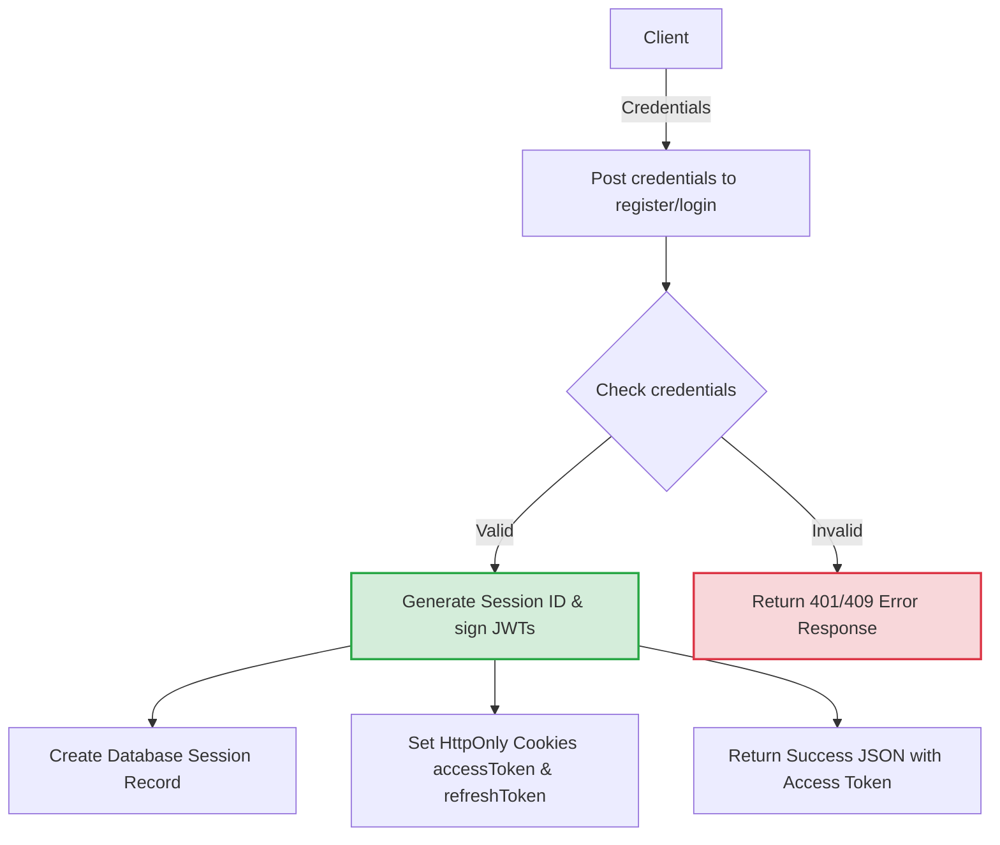
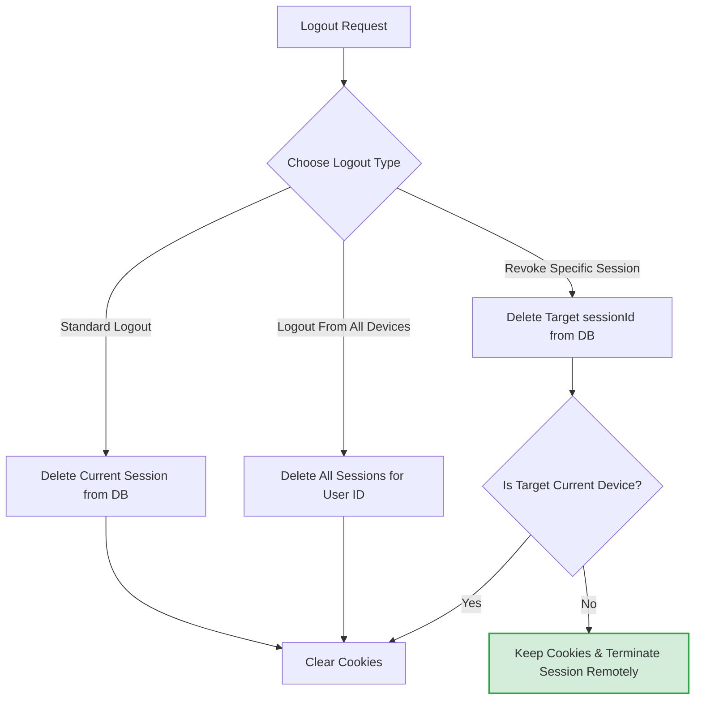

# Advanced Authentication System

A secure, enterprise-grade, session-aware authentication system built with **Node.js**, **Express**, **MongoDB (Mongoose)**, and **JSON Web Tokens (JWT)**.

This system implements robust modern security protocols including **Refresh Token Rotation (RTR)**, **Active Session Management**, **Instant Token Revocation**, and **Passwordless OTP-Based Authentication**.

---

## 🚀 Key Features

*   **Hybrid Session-Token Architecture**: Merges the performance benefits of stateless JWTs with the administrative control of stateful sessions.
*   **Refresh Token Rotation (RTR)**: Mitigates token theft by rotating both Access and Refresh tokens on every refresh request.
*   **Active Session Management**: Tracks clients' IP Address, User Agent, and login times, allowing users to view and revoke specific sessions.
*   **Logout From All Devices**: Instantly invalidates all active sessions and tokens for the user in a single request.
*   **Passwordless OTP Authentication**: Secure 6-digit OTP logins via email (with Nodemailer) or local console fallback for local development.
*   **XSS & CSRF Defense**: Stores authorization tokens securely in `httpOnly`, `secure`, `sameSite: "strict"` cookies.

---

## 📊 System Architecture & Flowcharts

For better readability and modular visibility, the system's operational flows are separated below:

### 1. Registration & Password Login Flow


### 2. Protected Route Verification Flow
```mermaid
graph TD
    classDef secure fill:#d4edda,stroke:#28a745,stroke-width:2px;
    classDef process fill:#d1ecf1,stroke:#17a2b8,stroke-width:2px;
    classDef danger fill:#f8d7da,stroke:#dc3545,stroke-width:2px;

    A[Client Request] -->|Read Access Token from Cookies or Headers| B{Verify JWT Signature}
    B -->|Valid| C{Check if sessionId exists in DB}
    B -->|Invalid / Expired| D["Clear Cookies & Return 401 Unauthorized"]:::danger
    C -->|Yes (Session Active)| E["Grant Route Access & Return User Context"]:::secure
    C -->|No (Session Revoked)| D
```

### 3. Refresh Token Rotation (RTR) Flow
```mermaid
graph TD
    classDef secure fill:#d4edda,stroke:#28a745,stroke-width:2px;
    classDef process fill:#d1ecf1,stroke:#17a2b8,stroke-width:2px;
    classDef danger fill:#f8d7da,stroke:#dc3545,stroke-width:2px;

    A[Client Refresh Request] -->|Read Refresh Token Cookie| B{Verify Signature & Expiration}
    B -->|Valid| C{Check if Token matches current in DB Session}
    B -->|Invalid / Expired| D["Clear Cookies, Revoke Session & Return 401"]:::danger
    C -->|Yes (Match)| E["Generate New Access & Rotated Refresh Token"]:::secure
    E --> F[Update DB Session with new Rotated Refresh Token]
    E --> G[Set New HTTP-only Cookies]
    E --> H[Return Success JSON with New Access Token]
    C -->|No (Replay/Theft Detected)| I["Wipe Session & Invalidate All Tokens"]:::danger
```

### 4. Session Revocation & Logout Flow


---

## 🛠️ Technology Stack

*   **Runtime Environment**: Node.js (ES Modules)
*   **Web Framework**: Express
*   **Database**: MongoDB & Mongoose
*   **Authentication**: JSON Web Tokens (`jsonwebtoken`)
*   **Mailing Service**: Nodemailer
*   **Security Utilities**: Crypto, cookie-parser

---

## ⚙️ Configuration & Environment

Create a `.env` file in the root directory and add the following keys:

```env
# MongoDB Connection URI
MONGO_URI=your_mongodb_connection_string

# JWT Signing Secret
JWT_SECRET=your_jwt_secret_hash

# Nodemailer SMTP Configuration (Optional - Falls back to dev console output if not set)
EMAIL_HOST=smtp.gmail.com
EMAIL_PORT=587
EMAIL_USER=your_email@gmail.com
EMAIL_PASS=your_email_app_password
```

---

## 🚦 API Endpoints

### 1. Authentication
*   `POST /api/auth/register` - Registers a new user.
    *   **Body**: `{ "username": "...", "email": "...", "password": "..." }`
*   `POST /api/auth/login` - Authenticates user & issues session cookies.
    *   **Body**: `{ "email": "...", "password": "..." }`
*   `POST /api/auth/logout` - Revokes current session & deletes cookies.
*   `GET /api/auth/get-me` - Retrieves current user info (Access Token required).

### 2. OTP Logins (Passwordless)
*   `POST /api/auth/send-otp` - Generates and sends OTP.
    *   **Body**: `{ "email": "..." }`
*   `POST /api/auth/login-otp` - Verifies OTP & signs in user (Registers user if not already present).
    *   **Body**: `{ "email": "...", "otp": "..." }`

### 3. Session Controls
*   `POST /api/auth/refresh` - Performs RTR to issue new Access/Refresh tokens.
*   `POST /api/auth/logout-all` - Logs out user from all active devices.
*   `GET /api/auth/sessions` - Returns all active sessions for the user with details (Device, IP, Current session flag).
*   `DELETE /api/auth/sessions/:sessionId` - Terminates a specific device session.

---

## 🏁 Getting Started

1. **Install dependencies**:
    ```bash
    npm install
    ```
2. **Start the development server**:
    ```bash
    npm run dev
    ```
